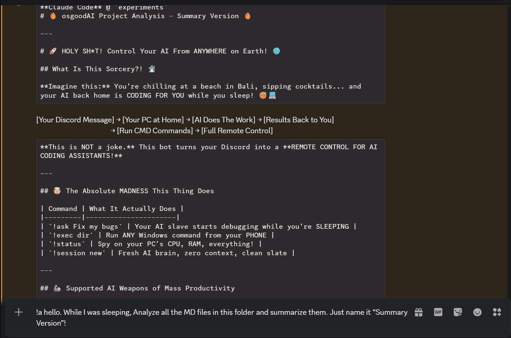

<div align="center">

# AI CLI Gateway Bot

### Your AI Codes While You Sleep

Control AI CLI tools on your PC remotely via Discord

[](../../releases/latest)
[](LICENSE)
[](https://nodejs.org/)
[](https://discord.js.org/)
[](https://www.typescriptlang.org/)

[한국어](README.md) · [Report Bug](../../issues/new) · [Request Feature](../../issues/new)

<br>



</div>

---

## ✨ Key Features

<table>
<tr>
<td width="50%">

### 🤖 Remote AI Control
Control Claude Code, Gemini CLI, OpenCode remotely via Discord messages

</td>
<td width="50%">

### 💬 Interactive Responses
When Claude asks questions, respond instantly with Discord buttons

</td>
</tr>
<tr>
<td width="50%">

### 🔒 Security First
Whitelist-based access control + dangerous command blocking

</td>
<td width="50%">

### 📦 One-Click Launch
Just double-click the exe file to start

</td>
</tr>
</table>

---

## ⚡ Quick Start

### 1️⃣ Download
Get `aidevelop-bot.exe`, `cli.js`, `.env.example` from [GitHub Releases](../../releases/latest)

### 2️⃣ Run
Double-click `aidevelop-bot.exe` → Enter bot token & user ID

### 3️⃣ Use
Type `!ask review my code` in Discord!

> 💡 **Prerequisites**: See [Creating a Discord Bot](#creating-a-discord-bot) section

---

## 📋 Commands

| Command | Alias | Description |
|:--------|:------|:------------|
| `!ask <message>` | `!a` | Send message to AI |
| `!session info` | `!s` | Check session status |
| `!session new` | `!s new` | Start new conversation |
| `!session kill` | `!s stop` | Stop running AI |
| `!exec <command>` | `!run`, `!cmd` | Execute CMD command |
| `!status` | `!sysinfo` | System info |
| `!myid` | `!id` | Check Discord ID |
| `!help` | | Show help |

---

## 🤖 Supported AI Tools

| Tool | Integration | Interactive | Session |
|:-----|:-----------|:-----------:|:-------:|
| **Claude Code** | Agent SDK | ✅ | ✅ |
| **Gemini CLI** | subprocess | ❌ | ❌ |
| **OpenCode** | subprocess | ❌ | ❌ |

> **Claude Code** communicates directly via Agent SDK. When AI asks for choices, you can respond with Discord buttons!

---

## 📦 Installation

<details>
<summary><b>Method 1: exe File (Recommended)</b></summary>

### Prerequisites
- **Node.js v18+** (required for Claude Code)
- Claude Code auth (`claude login` or `ANTHROPIC_API_KEY`)

### Install
1. Download 3 files from [Releases](../../releases/latest)
2. **Place in same folder** (`cli.js` required for Claude Code!)
3. Double-click `aidevelop-bot.exe`

### First Run
```
================================================
  Initial Setup — Creating .env file
================================================

  [1/2] Discord Bot Token: ████████████████████
  [2/2] Discord User ID: 123456789012345678

  .env file has been created!
```

</details>

<details>
<summary><b>Method 2: Batch File (Windows)</b></summary>

```bash
# 1. Initial setup
setup.bat

# 2. Run bot
start_bot.bat
```

</details>

<details>
<summary><b>Method 3: Manual Install (Node.js)</b></summary>

```bash
npm install
npx tsx src/bot.ts
```

</details>

---

## ⚙️ Configuration

### Environment Variables (.env)

| Variable | Required | Default | Description |
|:---------|:--------:|:-------:|:------------|
| `DISCORD_BOT_TOKEN` | ✅ | — | Discord bot token |
| `ALLOWED_USER_IDS` | ✅ | — | Allowed user IDs (comma-separated) |
| `ANTHROPIC_API_KEY` | ❌ | — | API key (not needed with `claude login`) |
| `COMMAND_PREFIX` | ❌ | `!` | Command prefix |
| `COMMAND_TIMEOUT` | ❌ | `30` | CMD timeout (seconds) |
| `AI_CLI_TIMEOUT` | ❌ | `300` | AI timeout (seconds) |

### Multiple Users

```env
ALLOWED_USER_IDS=111111111111111111,222222222222222222
```

---

## 🔧 Creating a Discord Bot

<details>
<summary><b>Expand detailed guide</b></summary>

1. Go to [Discord Developer Portal](https://discord.com/developers/applications)
2. **New Application** → Enter name → Create
3. **Bot** tab → **Reset Token** → Copy token
4. **Bot** tab → **Privileged Gateway Intents**:
   - ✅ Presence Intent
   - ✅ Server Members Intent
   - ✅ **Message Content Intent** (required!)
5. **OAuth2** → **URL Generator**:
   - Scopes: `bot`
   - Permissions: `Send Messages`, `Read Message History`, `Attach Files`
6. Invite bot using the generated URL

> ⚠️ **Your token is like a password. Never share it!**

</details>

---

## 🛠️ Troubleshooting

<details>
<summary><b>Common Issues</b></summary>

| Symptom | Solution |
|:--------|:---------|
| `cli.js file not found` | Place `cli.js` in same folder as exe |
| `Node.js is not installed` | Install [Node.js v18+](https://nodejs.org/) |
| Claude auth error | Run `claude login` or set API key |
| `You are not authorized` | Check ID with `!myid` → Add to `.env` |
| Bot not responding | Enable **Message Content Intent** |

</details>

---

## 🏗️ Building (For Developers)

<details>
<summary><b>exe Build Instructions</b></summary>

### Prerequisites
- Install [Bun](https://bun.sh/): `npm install -g bun`

### Build
```bash
# Method 1
build.bat

# Method 2
npm run build:exe
```

### Output
```
dist/
├── aidevelop-bot.exe    ← Executable
├── cli.js               ← Agent SDK runtime
└── .env.example         ← Config template
```

</details>

---

## 🤝 Contributing

Contributions are welcome! Please check [CONTRIBUTING.md](CONTRIBUTING.md).

---

## ☕ Support

If this project helped you, buy us a coffee!

<div align="center">

| Maintainer | Support |
|:----------:|:-------:|
| **hamsik2rang** | [](https://buymeacoffee.com/hamsik2rang) |
| **osgood** | [](https://buymeacoffee.com/osgoodyz) |

</div>

---

## 📄 License

[MIT](LICENSE) © 2024

---

<div align="center">

**Code with AI from anywhere via Discord** 🚀

[⬆ Back to Top](#ai-cli-gateway-bot)

</div>
